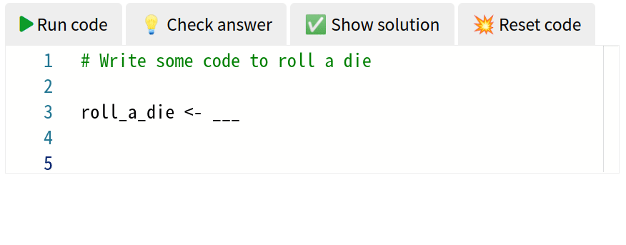

# webR teachr extension for Quarto

This extension enables the [webR](https://docs.r-wasm.org/webr/latest/) code cell within various [Quarto](https://quarto.org/) formats, along with tools for checking that the code achieved a specific goal.

It is a fork of the quarto-webr extension, and all of the documentation for this extension also applies here. Most of the documentation for using webr with quarto can be found here: https://github.com/coatless/quarto-webr

# Installation

To use this extension in a Quarto project, install it from within the project's working directory by typing into Terminal:

```
quarto add learnr-academy/quarto-webr-teachr
```

# Usage

For each document, place the webr filter in the document's header:

```yaml
filters:
  - webr-teachr
```


````
---
title: webR in Quarto HTML Documents
format: html
engine: knitr
filters:
  - webr-teachr
---

This is a webR teachr enabled code cell in a Quarto HTML document.

```{webr-teachr}
# Write some code to roll a die

roll_a_die <- <<function(){sample(1:6, size = 1)}>>

???

rolls <- vapply(seq_len(1000), function(x) roll_a_die(), integer(1L))
c(
  "Your function should return an integer" = !is.integer(rolls),
  "Your function returns dice numbers less than 1." = min(rolls) < 1L,
  "Your function returns dice numbers more than 6." = max(rolls) > 6L
  
)
```
````



The displayed code and answer checking within a webr-teachr chunk is separated by `???`.

## The code cell contents

Code fenced by `<<>>` will be treated as fill in the blank exercises, where their contents are hidden on the website but shown when the `✅ Show solution` button is pressed. The code can be reset to its initial state by pressing `💥 Reset code`.

## Checking code

The `💡 Check answer` button will run the tests specified below the `???` separator.

This button will first run all of the user's code, and then run the code below the separator.

The last value should be a named logical vector (you can also use `return()` to stop checking earlier and give hints).

The names of this logical vector are the hints which are shown when the test returns `TRUE`. In the example above, `min(rolls) < 1L` was TRUE since the user sampled between 0 and 6. As a result, the helpful hint of `"Your function returns dice numbers less than 1."` was returned.

These tests have access to:

* user defined objects (such as the `roll_a_die` function shown above)
* any printed objects which are stored in the `.printed` list
* any error messages which are stored in the `.errored` character vector
* any warning messages which are stored in the `.warned` character vector
* the user's unparsed source code, available in the `.src` object
* the user's parsed code, available in the `.code` expression
